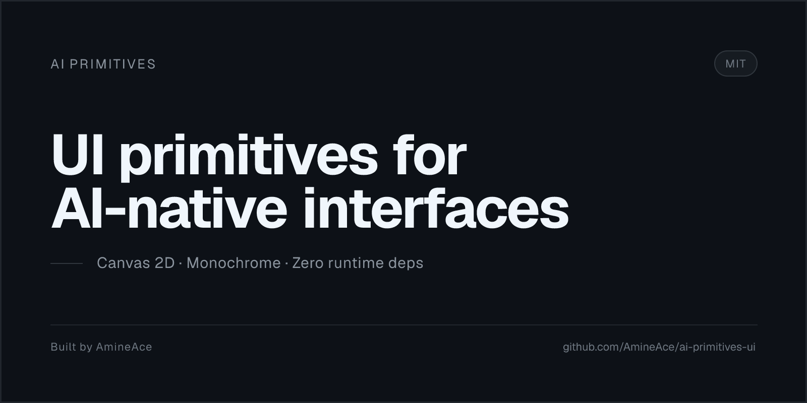

<div align="center">



[](https://www.npmjs.com/package/@ai-primitives-ui/ui)
[](https://ai-primitives-ui.vercel.app)
[](https://github.com/AmineAce/ai-primitives-ui)

**UI primitives for AI-native interfaces — drawn in monochrome, Canvas 2D only.**

</div>

---

## ✨ Features

- **18 ready primitives** across Loading State, Thinking, Streaming, and Cards — one more coming soon
- **Zero runtime dependencies** — peer deps are React 18/19 only
- **Plain HTML5 Canvas 2D** — no WebGL, no SVG filters, no `ctx.filter`, no blur
- **Monochrome by design** — GitHub Primer grayscale, themed via CSS variables
- **Accessible** — `aria-label` support, `prefers-reduced-motion` renders a static frame
- **Typed** — full TypeScript surface, `publint` + `attw` publish gates
- **Theme-aware** — system `matchMedia`, global `--orb-fg`, or per-instance `color`

## 📦 Install

```bash
npm install @ai-primitives-ui/ui
# pnpm
pnpm add @ai-primitives-ui/ui
```

Peer dependencies: React 18 or 19. Zero runtime dependencies.

## 🚀 Usage

```tsx
import { CloningOrb, SyncOrb, orbSizes } from "@ai-primitives-ui/ui";

export function CloningIndicator() {
  return (
    <CloningOrb size={orbSizes.xl} speed={1} aria-label="Cloning repository" />
  );
}

export function SyncIndicator() {
  return <SyncOrb size={64} aria-label="Sync" />;
}
```

Every orb accepts `size?: number | OrbSizePreset` (`orbSizes`: `xs 16`, `sm 24`, `md 32`, `lg 48`, `xl 64`, `2xl 96`), `speed?: number` (default `1`), `paused?: boolean`, `color?: string`, `aria-label?: string`.

## 🧩 Primitives

### Loading State — 8 orbs

| Component     | What it shows                                                        |
| ------------- | -------------------------------------------------------------------- |
| `CloningOrb`  | Dots spiral onto an empty sphere, filling it layer by layer          |
| `SyncOrb`     | Square panel → waves → supernova into a globe with a contained flash |
| `FetchingOrb` | Packets pulse outward, snap onto the surface, peel back in           |
| `PullingOrb`  | Fetch + merge combined — remote dots flow in and integrate           |
| `PushingOrb`  | Local commits detach and launch outward to the remote                |
| `MergingOrb`  | Two branches converge at a junction and continue as one              |
| `RebasingOrb` | Orbs replay onto three equator rings, filling the globe              |
| `StashingOrb` | Scattered dots converge into a core, flash shut, then reapply        |

### Thinking — 2

`CubeOrb` (Thinking) · `ScanOrb` (Scan)

### Streaming & Cards — 8

`StreamingText` · `ApprovalCard` · `ToolChips` · `TaskRows` · `Chat` · `RecommendationCard` · `ContextCards` · `DiffTable`

## 🎨 Theming

1. **System** — `matchMedia("(prefers-color-scheme: light)")` + an inline script sets `data-theme` before hydration (no FOUC); follows the OS when no stored choice
2. **Global** — `--orb-fg` on any ancestor themes every orb:

```css
:root {
  --orb-fg: var(--fg-default);
}
```

3. **Per instance** — `color` wins, alpha is orb-controlled:

```tsx
<CloningOrb color="#e6edf3" />
```

## 🎮 Playground

Try every ready primitive live — orbs expose `size / speed / paused`; streaming, approval, tool chips, task rows, and chat are testable.

**→ https://ai-primitives-ui.vercel.app/#playground**

## 📚 Docs

Full documentation at **https://ai-primitives-ui.vercel.app/docs** — grouped primitives, `orbSizes`, playground, theming, accessibility, and API tables.

## 🛠️ Development

```bash
pnpm install
pnpm dev      # .next-dev on :3000, Next 14
pnpm check    # format → lint → typecheck → test → gates → build
```

## 🔗 Links

- **Live** — https://ai-primitives-ui.vercel.app
- **Docs** — https://ai-primitives-ui.vercel.app/docs
- **Playground** — https://ai-primitives-ui.vercel.app/#playground
- **npm** — https://www.npmjs.com/package/@ai-primitives-ui/ui
